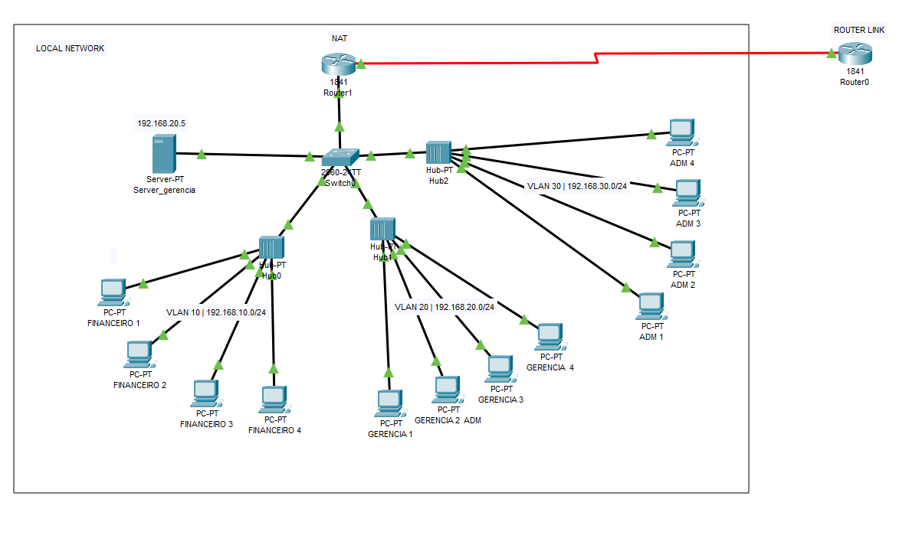

<h1>Projeto de criação de redes com VLANs, ACL e Conexão com a internet</h1>

Concluído mais um curso de redes acredito que esteja indo bem principalmente por está tendo a possibilidade de testar isso tudo no meu trabalho, segue imagem do projeto e o arquivo do Cisco Packet Tracer.

</img>
